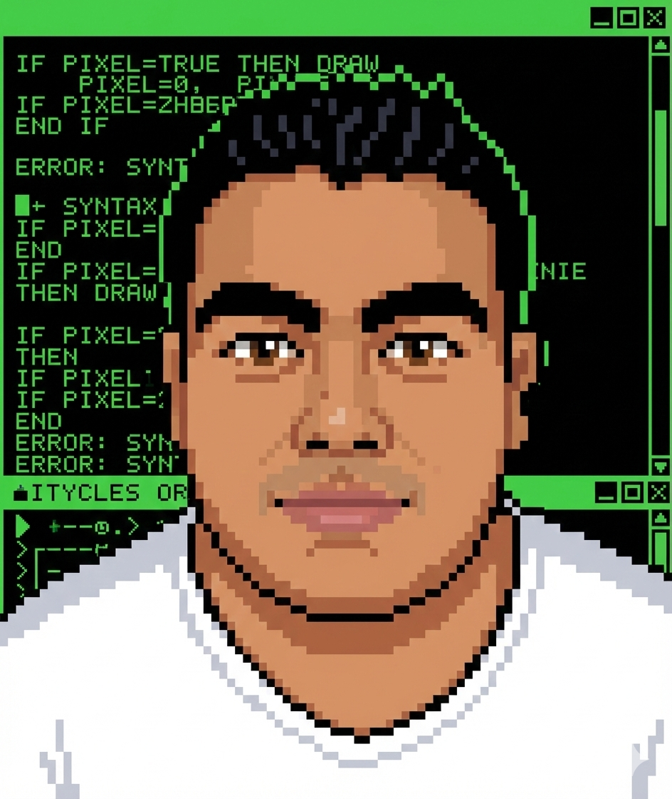

<h1 align="center">
Hi, I'm Pablo Adrián
  </h1>
 <!---->
  <a href="https://github.com/I-am-vishalmaurya/I-am-vishalmaurya/"> </a> 
<br/>

<!-- Typing SVG by DenverCoder1 - https://github.com/DenverCoder1/readme-typing-svg -->
<p align="center">
  <a href="https://github.com/DenverCoder1/readme-typing-svg}"></a>
</p>


<hr>

```
I-am-Pablo Adrián Herrera Amieva
-------------------------
💻 Soy Ingeniero en Sistemas Computacionales.
🛜 Soy Freelance: Desarrollador de Software | Profesor Jr. | IA
📝 Titulado en Técnico en Programacion.
💻 Titulado en Ingenieria en Sistemas Computacionales.
🧑🏽‍💻 Manejo de soporte técnico, ciberseguridad, instalación de software.
🌟 Front-End: HTML, CSS,JavaScript, Rect JS, Boostraps, JQuery, IA.
🌟 Back-End: PHP, MYSQL, C++, JAVA, Node Js, Python.
🤖 Robótica: Arduino.
🔰 Microsoft Office: Word, Excel, PowerPoint.
🖥️ Creador de ProfeTechmike.
🛜 Tutoriales: Ofimática, Matemáticas, Programacion, Base de Datos y Robótica.
```
<hr>


## 🛠️ My Favorite Tools

### 👨‍💻 Programming Languages

<p>
    <a href="https://github.com/search?q=user%3ADenverCoder1+is%3Arepo+language%3Acss"></a>
    <a href="https://github.com/search?q=user%3ADenverCoder1+is%3Arepo+language%3Ahtml"></a>
    <a href="https://github.com/search?q=user%3ADenverCoder1+is%3Arepo+language%3Ajava"></a>
    <a href="https://github.com/search?q=user%3ADenverCoder1+is%3Arepo+language%3Ajavascript"></a>
    <a href="https://github.com/search?q=user%3ADenverCoder1+is%3Arepo+language%3Ajavascript"></a>
    <a href="https://github.com/search?q=user%3ADenverCoder1+is%3Arepo+language%3Aphp"></a>
    <a href="https://github.com/search?q=user%3ADenverCoder1+is%3Arepo+language%3Apython"></a>
    <a href="https://github.com/search?q=user%3ADenverCoder1+is%3Arepo+language%3Asql"></a>
    <a href="https://github.com/search?q=user%3ADenverCoder1+is%3Arepo+language%3Acplusplus"></a>

### 🧰 Frameworks and Libraries

<p>
    <a href="#"></a>
    <a href="#"></a>
    <a href="https://github.com/search?q=user%3ADenverCoder1+jquery"></a>

</p>

### 🗄️ Databases

<p>
    <a href="#"></a>
    <a href="#"></a>
</p>

### 🤖 Robotics

<p>
<a href="https://github.com/search?q=user%3ADenverCoder1+is%3Arepo+language%3Aarduino"></a>
</p>

### 🤖 IA
<p>
<a href="https://github.com/search?q=user%3ADenverCoder1+chatgpt" target="_blank">
  
</a>
<a href="https://github.com/search?q=user%3ADenverCoder1+gemini" target="_blank">
  
</a>
<a href="https://github.com/search?q=user%3ADenverCoder1+claude" target="_blank">
  
</a>
</p>

### 🛜 Servidor

<p>
<a href="https://github.com/search?q=user%3ADenverCoder1+xampp"></a>
</p>

### 💻 Software and Tools

<p>
    <a href="#"></a>
    <a href="#"></a>
    <a href="#"></a>
    <a href="#"></a>
</p>

### 🛠️ Soporte e Instalación
<p>
    <a href="https://github.com/search?q=user%3ADenverCoder1+soporte"></a>
<a href="https://github.com/search?q=user%3ADenverCoder1+instalacion"></a>
<a href="https://github.com/search?q=user%3ADenverCoder1+robotica"></a>
</p>

### 🎨 Diseño y Multimedia
<p>
<a href="https://github.com/search?q=user%3ADenverCoder1+videos"></a>
<a href="https://github.com/search?q=user%3ADenverCoder1+logos"></a>
</p>

### 🌐 Desarrollo Web y Aplicaciones
<p>
<a href="https://github.com/search?q=user%3ADenverCoder1+web"></a>
<a href="https://github.com/search?q=user%3ADenverCoder1+webapps"></a>
<a href="https://github.com/search?q=user%3ADenverCoder1+exe"></a>
</p>

### 📊 Ofimática y Datos
<p>
<a href="https://github.com/search?q=user%3ADenverCoder1+excel"></a>
<a href="https://github.com/search?q=user%3ADenverCoder1+formularios"></a>
<a href="https://github.com/search?q=user%3ADenverCoder1+documentos"></a>
</p>

### 💻 Redes Sociales
<p>
<a href="https://www.twitch.tv/profetechmike" target="_blank">
  
</a>
<a href="https://www.tiktok.com/@profetechmike" target="_blank">
  
</a>
<a href="https://www.facebook.com/people/Profetechmike-Bigherreralab/61577086169921/" target="_blank">
  
</a>
<a href="https://www.instagram.com/profetechmike/" target="_blank">
  
</a>
</p>

### 🔗 Portafolio-Web
<p>
<a href="https://pablo-profetechmike.github.io/Portafolio-web/index.html" target="_blank">
  
</a>
<a href="https://www.linkedin.com/in/pablo-adri%C3%A1n-herrera-amieva-a86117184/" target="_blank">
  
</a>
<a href="https://github.com/Pablo-ProfeTechMike" target="_blank">
  
</a>
</p>


## GitHub Stats

| Mi Actividad en GitHub |
|:---:|
|  |
|  |


| Mis Estrellas Totales | Lenguajes más Usados |
|:---:|:---:|
|  |  |

<table style="border: none">
  <tr>
  <td width="50%" valign="top">

## ¡Trabajemos juntos en tu proyecto!

Si tienes alguna pregunta sobre el desarrollo web front-end, no dudes en <a href="mailto:trabajoing956@outlook.com">contactarme por correo electrónico</a>.

Puedes contratarme como freelancer en <a href="https://www.fiverr.com/share/QDr4mw">Fiverr</a> o <a href="https://www.linkedin.com/in/vishalmaurya/">LinkedIn</a> para implementar tu proyecto de aprendizaje automático en la web.

  </td>
  <td width="50%" valign="top">

## No es perfecto, ¿verdad?

****

“Creo que es muy importante tener un sistema de retroalimentación, donde uno piense constantemente en lo que ha hecho y cómo podría mejorarlo.”

– Elon Musk

  </td>
  </tr>
</table>

------
Credits: [I-am-Pablo Adrián Herrera Amieva](https://github.com/I-am-vishalmaurya)
Last Edited On: 20/09/2025


